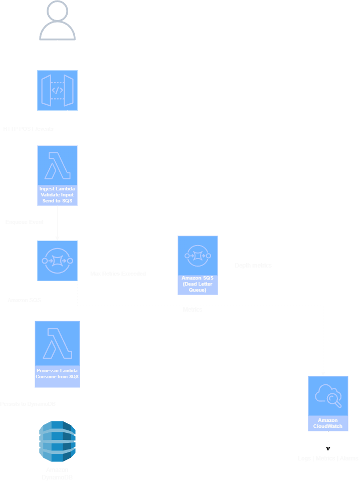

# Event-Driven AWS Architecture (Terraform)

## Overview

This project provisions a production-style event-driven serverless backend on AWS using Terraform (Infrastructure as Code).

The goal was to build a realistic cloud architecture where services are decoupled, scalable, and resilient — not just deploy a single Lambda function.

Clients send messages to an API endpoint, and the system processes them asynchronously before storing them in a database.

---

## Architecture

### AWS Services Used

- AWS Lambda (Ingest + Processor)
- Amazon API Gateway (HTTP API)
- Amazon SQS
- Amazon SQS Dead Letter Queue (DLQ)
- Amazon DynamoDB
- IAM Roles & Policies
- Amazon CloudWatch
- Terraform

---

### Request Flow

1. Client sends a `POST` request to API Gateway
2. API Gateway triggers the Ingest Lambda
3. Ingest Lambda validates input and sends message to Amazon SQS
4. SQS triggers the Processor Lambda
5. Processor Lambda stores the message in DynamoDB
6. Logs are recorded in CloudWatch
7. Failed messages are routed to the Dead Letter Queue
8. API returns confirmation to the client

---

## Why This Architecture?

- Decoupled services using SQS
- Asynchronous processing for scalability
- Failure handling with DLQ
- Serverless auto-scaling
- Infrastructure as Code using Terraform
- Observability through CloudWatch

---

### Architecture Diagram

<p align="center">
  
</p>


---
## Tech Stack

- Terraform (HCL)
- Python (AWS Lambda runtime)
- AWS (us-east-2)
- Git & GitHub

---

## Project Structure

```
.
├── main.tf
├── provider.tf
├── variables.tf
├── outputs.tf
├── lambda/
│   └── processor.py
└── lambda_ingestion/
    └── ingest.py
```

---

# Deployment

## 1. Prerequisites

- AWS account
- Terraform installed (>= 1.x)
- AWS CLI configured (`aws configure`)
- IAM user with permissions for:
  - Lambda
  - API Gateway
  - SQS
  - DynamoDB
  - IAM
  - CloudWatch

Verify credentials:

```bash
aws sts get-caller-identity
```

---

## 2. Initialize Terraform

```bash
terraform init
```

---

## 3. Review the Plan

```bash
terraform plan
```

---

## 4. Deploy Infrastructure

```bash
terraform apply
```

Type `yes` when prompted.

Terraform will output the API Gateway endpoint URL.

---

## 5. Test the API

```bash
curl -X POST https://<api-id>.execute-api.us-east-2.amazonaws.com \
  -H "Content-Type: application/json" \
  -d '{"message": "Hello from Terraform project"}'
```

Example response:

```json
{
  "status": "Message accepted"
}
```

---

## 6. Verify Processing

- Check DynamoDB table for stored message
- Check CloudWatch logs for Lambda execution
- Check DLQ if testing failure scenarios

---

## 7. Destroy Infrastructure (Avoid Charges)

```bash
terraform destroy
```

---

## Security Considerations

- IAM roles follow least-privilege principles
- No hardcoded AWS credentials
- Environment variables used for resource references
- DLQ prevents message loss during failures

---

## Future Improvements

- Add API authentication (JWT / Cognito)
- Add request schema validation
- Add CloudWatch alarms
- Implement CI/CD pipeline (GitHub Actions)
- Add structured logging & tracing (AWS X-Ray)
- Add idempotency handling for duplicate messages

---

## What I Learned

- Designing decoupled cloud systems
- Building asynchronous event-driven workflows
- Managing IAM permissions across services
- Writing modular Terraform configurations
- Debugging distributed systems using CloudWatch logs
